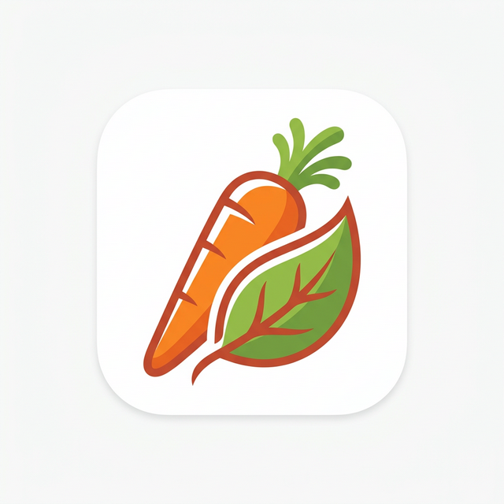

# What to Cook? 🍳

**What to Cook?** is a sleek, modern personal food journal and menu planner built with Expo and React Native. Designed to solve the "what should I eat?" dilemma, it combines a beautiful visual journal with an intelligent recommendation engine that learns from your cooking habits.



## Core Features

### Intelligent Recommendation Engine (Upgraded)
The home feed features a smart "Recommended for You" section driven by a multi-factor scoring algorithm:
- **Haven’t Cooked in a While:** Automatically prioritizes forgotten favorites to bring variety back to your table.
- **Habit-Based Context:** Learns your routine (Breakfast, Lunch, Dinner) and suggests appropriate meals for the current time of day.
- **Anti-Repetition:** Applies a gentle penalty to meals you've cooked recently to keep your feed fresh.
- **Weighted Scoring:** Combines recency, habit frequency, and category matching for a personalized experience.
- **Variety Layer:** A randomness factor ensures the suggestions feel human and diverse every day.

### 📸 Visual Food Journal
- **Capture & Document:** Add photos, titles, and detailed preparation notes for every dish.
- **Smart Tags:** Organize meals by ingredients or diet with a dynamic tagging system.
- **Multi-Category Support:** Assign meals to multiple categories (e.g., "Breakfast" and "Snack").
- **Automatic Image Management:** Modern file handling ensures your device storage stays lean.

### Habit & History Tracking
- **Cooking Logs:** Every time you cook, the app logs the event, building a rich history of your culinary journey.
- **Custom Habit Windows:** Define your own Breakfast, Lunch, and Dinner times to tailor recommendations to your lifestyle.
- **Proactive Suggestions:** Get local notifications suggesting a dinner idea based on your tastes and history.

### Universal Design
- **Sleek & Warm Aesthetic:** A curated color palette of oranges and reds designed to evoke appetite and comfort.
- **Full Dark Mode:** A high-contrast dark theme optimized for evening meal planning.
- **Localized:** Fully translated into English, Hindi, Marathi, French, and Spanish.
- **Local-First & Private:** Your data stays on your device in a secure SQLite database.

## Tech Stack

- **Framework:** [Expo](https://expo.dev) SDK 54 (React 19 / React Native 0.81)
- **Navigation:** [Expo Router](https://docs.expo.dev/router/introduction/) (Type-safe, file-based)
- **Database:** `expo-sqlite` with `cook_logs` and `recipes` relational schema
- **State Management:** React Context API with optimized SQLite hooks
- **Animations:** High-performance gestures via `react-native-gesture-handler` & `reanimated`
- **File System:** Modern `expo-file-system/next` API for robust asset management
- **Data Portability:** ZIP-based backup/restore pipeline using `jszip`

## Getting Started

### 1. Prerequisites
- [Node.js](https://nodejs.org/) (LTS)
- [Expo Go](https://expo.dev/go) on your mobile device or a development build

### 2. Installation
```bash
npm install
```

### 3. Running the App
```bash
npx expo start
```
Scan the QR code with your device to start exploring your kitchen!

## 🎨 Design Principles
- **Atmospheric:** Uses warm tones and smooth transitions to create an inviting cooking companion.
- **Constraint-Driven:** Strictly avoids purple/violet tones to maintain a focused "food-app" identity.
- **Performance-First:** Optimized image rendering and database queries for a "native" feel even with large collections.

---
Built with ❤️ for home cooks who love variety.
